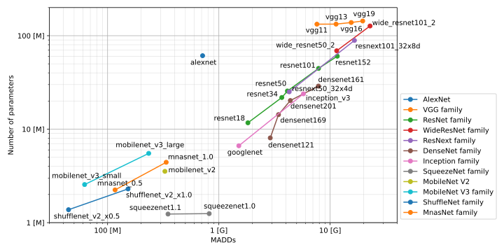

pytorch-op-counter-layerwise
================================================================================

This repository provides `thoplw` that is a ython module to compute MACs
(multiply–accumulate operations) and number of parameters for each layer
of neural network models implemented by PyTorch.


Installation
--------------------------------------------------------------------------------

### Dependencies

The `thoplw` module requires:

* PyTorch >= 2.0.0 (will work on the older version, but not checked)

and the sample code require:

* Torchvision >= 0.15.0

### User installation

```console
pip install thoplw
```


Usage
--------------------------------------------------------------------------------

### Minimal example

```python
import torch, torchvision, thoplw

# Instanciate the target model.
model = torchvision.models.resnet18()

# Compute MACs, number of parameters, and details of each layer.
macs, params, layers_info = thoplw.profile(model, tensor=torch.randn(1, 3, 224, 224))

# Print the total MACs and number of parameters.
print("Total MACs and params:")
print("  - Macs   =", macs)
print("  - Params =", params)
print()

# Print layer details.
print(layers_info.summary())
```

Running the above code will give you the output below
(the table has been partially omitted because it is too long to show everything in this README).

```
Total MACs and params:
  - Macs   = 1824010216                                                                                                                                                       
  - Params = 11699112

| Name                  | Class             | Input shape    | Output shape   | MACs       | Params   |
+-----------------------+-------------------+----------------+----------------+------------+----------+
| conv1                 | Conv2d            | 3 x 224 x 224  | 64 x 112 x 112 | 118013952  | 9408     |
| bn1                   | BatchNorm2d       | 64 x 112 x 112 | 64 x 112 x 112 | 3211264    | 256      |
| relu                  | ReLU              | 64 x 112 x 112 | 64 x 112 x 112 | 0          | 0        |
| maxpool               | MaxPool2d         | 64 x 112 x 112 | 64 x 56 x 56   | 0          | 0        |
...
| layer4.1.conv2        | Conv2d            | 512 x 7 x 7    | 512 x 7 x 7    | 115605504  | 2359296  |
| layer4.1.bn2          | BatchNorm2d       | 512 x 7 x 7    | 512 x 7 x 7    | 100352     | 2048     |
| avgpool               | AdaptiveAvgPool2d | 512 x 7 x 7    | 512 x 1 x 1    | 1024       | 0        |
| fc                    | Linear            | 512            | 1000           | 513000     | 513000   |
+-----------------------+-------------------+----------------+----------------+------------+----------+
| Total                 | ResNet            | 3 x 224 x 224  | 1000           | 1824010216 | 11699112 |
```

### Clever formatting

The `thoplw` provides `clever_format` function that returns appropriate expressions
of the given numbers likewise `thop` package.

```python
macs, params = thoplw.clever_format([macs, params], "%.3f")
print("Total MACs and params:")
print("  - Macs   =", macs)
print("  - Params =", params)
```

The table of layers detail supports three types of formatting, raw number (default choice),
clever format like the `clever_format` function, and ratio.

```python
# Print the table with clever formatting.
print(layers_info.summary(kind="text", fmt="clever"))

# Print the table with ratio formatting.
print(layers_info.summary(kind="text", fmt="ratio"))
```

### Table type

The above example prints the NN model summary as a plain text, but you can dump the summary
as CSV and Markdown format too. The following is an example to save the table as CSV and
Markdown format respectively.

```python
# Save as CSV format.
with open("summary.csv") as ofp:
    ofp.write(layers_info.summary(kind="csv"))

# Save as Markdown format.
with open("summary.md") as ofp:
    ofp.write(layers_info.summary(kind="md"))
```

API reference
--------------------------------------------------------------------------------

### thoplw.profile

```python
macs, params, layers_info = thoplw.profile(model: torch.nn.Module,
                                           tensor: torch.Tensor,
                                           custom_ops: dict = {},
                                           verbose: bool = True)
```

Computes MADDs and the number of parameters.

* Args
  - `model`: the target NN model.
  - `tensor`: input tensor for the `model`.
  - `custom_ops`: optional custom operations.
  - `verbose`: shows extra message on your terminal if `True`.
* Returns
  - `macs`: total MADDs of the target model and the given input tensor.
  - `params`: number of parameters of the target model.
  - `layer_info`: `LayerInfo` class that store the details of each layer.

### thoplw.clever_format

```python
formatted_values = thoplw.clever_format(values: int or list, fmt: str = "%6.2f")
```
Returns formatted string of the given integer(s).

* Args
  - `values`: input value, or values.
  - `fmt`: format specifier.
* Returns
  - `formatted_values`: format result.

### LayerInfo class

```python
class LayerInfo:
    ...
    def summary(self,
                kind: str = "text",
                fmt: str = "raw") -> str:
    ...
```
A class to store layer details. Only the `summary` function is opened to users.

* Args
  - `kind`: table type to be returned (`"text"` means simple table, `"csv"` means CSV, and `"md"` means Markdown).
  - `fmt`: output format (`"raw"` means raw integer, `"clever"` means auto formatting, and `"ratio"` means ratio format).
* Returns
  - formatted string.


Results of Recent Models
--------------------------------------------------------------------------------

The following results can be obtained by running `tests/test_benchmarks.py`.
Click the model anem to see the layer details.

| Model name                                               | Params [M] | MACs [G] | | Model name                                                   | Params [M] | MACs [G] |
|:--------------------------------------------------------:|:----------:|:--------:|-|:------------------------------------------------------------:|:----------:|:--------:|
| [alexnet](tests/benchmarks/alexnet.md)                   |  714.22 M  |  61.10 M | | [resnext50_32x4d](tests/benchmarks/resnext50_32x4d.md)       |    4.29 G  |  25.10 M |
| [vgg11](tests/benchmarks/vgg11.md)                       |    7.61 G  | 132.86 M | | [resnext101_32x8d](tests/benchmarks/resnext101_32x8d.md)     |   16.54 G  |  88.99 M |
| [vgg11_bn](tests/benchmarks/vgg11_bn.md)                 |    7.64 G  | 132.87 M | | [densenet121](tests/benchmarks/densenet121.md)               |    2.90 G  |   8.06 M |
| [vgg13](tests/benchmarks/vgg13.md)                       |   11.31 G  | 133.05 M | | [densenet161](tests/benchmarks/densenet161.md)               |    7.85 G  |  28.90 M |
| [vgg13_bn](tests/benchmarks/vgg13_bn.md)                 |   11.36 G  | 133.06 M | | [densenet169](tests/benchmarks/densenet169.md)               |    3.44 G  |  14.31 M |
| [vgg16](tests/benchmarks/vgg16.md)                       |   15.47 G  | 138.36 M | | [densenet201](tests/benchmarks/densenet201.md)               |    4.39 G  |  20.24 M |
| [vgg16_bn](tests/benchmarks/vgg16_bn.md)                 |   15.52 G  | 138.37 M | | [googlenet](tests/benchmarks/googlenet.md)                   |    1.51 G  |   6.64 M |
| [vgg19](tests/benchmarks/vgg19.md)                       |   19.63 G  | 143.67 M | | [inception_v3](tests/benchmarks/inception_v3.md)             |    5.75 G  |  23.87 M |
| [vgg19_bn](tests/benchmarks/vgg19_bn.md)                 |   19.69 G  | 143.69 M | | [squeezenet1.0](tests/benchmarks/squeezenet1_0.md)           |  818.93 M  |   1.25 M |
| [resnet18](tests/benchmarks/resnet18.md)                 |    1.82 G  |  11.70 M | | [squeezenet1.1](tests/benchmarks/squeezenet1_1.md)           |  349.16 M  |   1.24 M |
| [resnet34](tests/benchmarks/resnet34.md)                 |    3.68 G  |  21.81 M | | [mobilenet_v2](tests/benchmarks/mobilenet_v2.md)             |  327.49 M  |   3.54 M |
| [resnet50](tests/benchmarks/resnet50.md)                 |    4.13 G  |  25.61 M | | [mobilenet_v3_small](tests/benchmarks/mobilenet_v3_small.md) |   62.17 M  |   2.55 M |
| [resnet101](tests/benchmarks/resnet101.md)               |    7.87 G  |  44.65 M | | [mobilenet_v3_large](tests/benchmarks/mobilenet_v3_large.md) |  234.21 M  |   5.51 M |
| [resnet152](tests/benchmarks/resnet152.md)               |   11.60 G  |  60.34 M | | [shufflenet_v2_x0.5](tests/benchmarks/shufflenet_v2_x0_5.md) |   44.57 M  |   1.37 M |
| [wide_resnet50_2](tests/benchmarks/wide_resnet50_2.md)   |   22.84 G  | 127.02 M | | [shufflenet_v2_x1.0](tests/benchmarks/shufflenet_v2_x1_0.md) |  152.71 M  |   2.29 M |
| [wide_resnet101_2](tests/benchmarks/wide_resnet101_2.md) |   11.46 G  |  68.95 M | | [mnasnet_0.5](tests/benchmarks/mnasnet_0_5.md)               |  116.72 M  |   2.24 M |
|                                                          |            |          | | [mnasnet_1.0](tests/benchmarks/mnasnet_1_0.md)               |  336.24 M  |   4.42 M |

<p align="center">
  
</p>


Gratitude
--------------------------------------------------------------------------------

* Developers and maintainers of
  [pytorch-OpCounter](https://github.com/Lyken17/pytorch-OpCounter).
  The author learned a lot from the repository.

